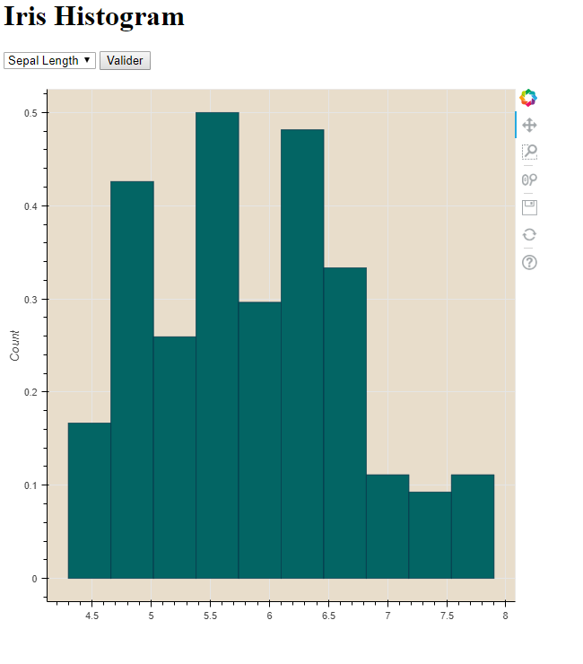
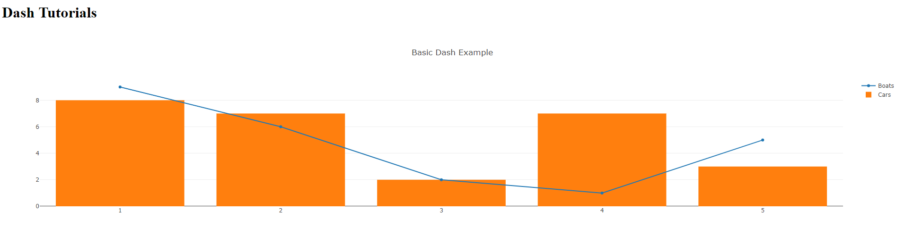

# Heroku Docker Templates

This project aims to setup an Heroku Docker Templates Project.
The following template projects use docker-compose.

## Project structure

- [bokeh-template](bokeh-template/) - Dockerfile + Sources files for the application.

  

- [dash-template](dash-template/) - Dockerfile + Sources files for the application.

  

## Reference

- [Local Development with docker-compose](https://devcenter.heroku.com/articles/local-development-with-docker-compose)
- [Deploying with docker](https://devcenter.heroku.com/categories/deploying-with-docker)

## Contribute

Contributions are always welcome!
Please read the [contribution guidelines](contributing.md) first.
