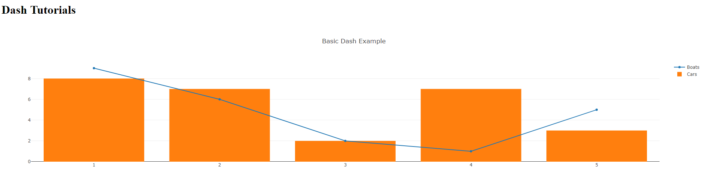

# Heroku Dash Template 

This project aims to setup an Heroku Dash Template Project.
This project uses docker-compose.

  

## Project structure

- [webapp](webapp/) - Sources files for the application.

## Reference

- [Local Development with docker-compose](https://devcenter.heroku.com/articles/local-development-with-docker-compose)
- [Deploying with docker](https://devcenter.heroku.com/categories/deploying-with-docker)

## Contribute

Contributions are always welcome!
Please read the [contribution guidelines](contributing.md) first.
